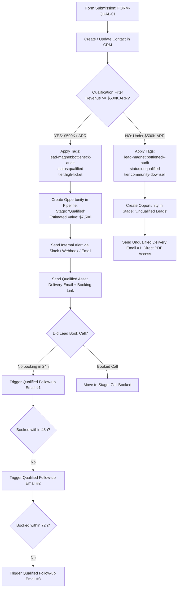

# PART 7: CRM PIPELINE & AUTOMATION WORKFLOWS SPECIFICATION
**Brand:** Pareto Talent  
**Lead Magnet:** The 10-Minute Bottleneck Audit  
**Backend Offer:** Dedicated "Right Hand" Executive Assistant Placement  
**Target ICP:** 7- and 8-figure Founders ($500K–$5M+ ARR)

---

## 1. CRM PIPELINE ARCHITECTURE

### Pipeline Name: `Pareto High-Ticket EA Pipeline`

| Stage Order | Stage Name | Definition & Entry Criteria | Automation Action Upon Entry | SLA / Goal |
|---|---|---|---|---|
| **Stage 1** | `Opted In` | Contact submitted the intake form `FORM-QUAL-01`. Initial entry point for all opt-ins. | Form webhook received. Contact created/updated. Initial lead magnet asset delivered immediately. | Immediate |
| **Stage 2** | `Qualified` | Lead selected **$500K–$1M ARR** or **$1M–$5M+ ARR** AND hiring timeline **"Immediately"** or **"Within 30 days"**. | Tag added: `status:qualified`. Opportunity value set ($6,000–$12,000 ACV). Qualified 3-Email Nudge Workflow initialized. Internal Slack/Email notification fired. | Book call within 72 hrs |
| **Stage 3** | `Call Booked` | Contact scheduled a 15-Minute Strategy Call via Calendly (`BOOK-CAL-01`). | Tag added: `status:call-booked`. Remove from *Qualified Follow-up* sequence. Enroll into *Booking Confirmation & Reminder* sequence. | Attend call (Target: >85% show rate) |
| **Stage 4** | `Client` | Discovery call completed, proposal signed, and placement deposit collected. | Tag added: `status:client`. Opportunity marked **Closed/Won**. Move to client onboarding intake. | Kickoff in 48 hrs |
| **Separated Stage** | `Unqualified Leads` | Revenue selected as **"Under $500K ARR"** or timeline **"Just researching"**. | Tag added: `status:unqualified`. Opportunity closed as *Unqualified / Self-Service*. Direct PDF delivery email triggered. Excluded from sales outreach. | N/A (Downsell/Nurture) |

---

## 2. OPT-IN WORKFLOW SPECIFICATION (FORM-QUAL-01 TRIGGER)

### Trigger
* **Event:** Form Submission on Landing Page (`FORM-QUAL-01`).
* **Payload Variables:** `first_name`, `last_name`, `email`, `phone`, `revenue`, `team_size`, `bottleneck`, `timeline`.

### Step-by-Step Logic Flow

### Automation Actions Breakdown:
1. **Deliver the Resource:** Direct personalized email sent with the public asset link:
   `https://docs.google.com/document/d/1Hd5MjJr7MtvgzcxJo9JyeO9HTrsipbSVjrudn6ifh_Q/edit?usp=sharing`
2. **Tag Allocation:**
   - Qualified: `lead-magnet:bottleneck-audit`, `status:qualified`, `route:calendar`
   - Unqualified: `lead-magnet:bottleneck-audit`, `status:unqualified`, `route:direct-download`
3. **Create Opportunity:**
   - Qualified: Assigned to Founder/Sales Pipeline in stage `Qualified` with value `$7,500`.
   - Unqualified: Moved to stage `Unqualified Leads` (value `$0`).
4. **Internal Notification (Slack / Email):**
   - **Notification Hook:**
     > 🚨 **New Qualified Founder Lead Captured!**  
     > **Name:** {{contact.name}}  
     > **Email:** {{contact.email}} | **Phone:** {{contact.phone}}  
     > **Revenue:** {{contact.revenue}}  
     > **Team Size:** {{contact.team_size}}  
     > **Core Bottleneck:** {{contact.bottleneck}}  
     > **Hiring Timeline:** {{contact.timeline}}  
     > **Pipeline Link:** [Open in CRM](https://crm.paretotalent.com/leads/{{contact.id}})

---

## 3. EMAIL COPYWRITING SUITE

### A. QUALIFIED FOLLOW-UP SEQUENCE (3 Emails)
*Target: Founders who qualified based on revenue and friction, but exited before booking their 15-minute diagnostic call.*

#### Email Q-1 (Send: 4 Hours after Opt-in if `status:call-booked` is false)
* **Subject:** Your Bottleneck Audit (+ the 1 common trap)
* **Preview Text:** Why 10-page SOPs fail with traditional virtual assistants...
* **Body:**
> Hey {{contact.first_name}},
>
> Your copy of **The 10-Minute Bottleneck Audit** is ready for you [here](https://docs.google.com/document/d/1Hd5MjJr7MtvgzcxJo9JyeO9HTrsipbSVjrudn6ifh_Q/edit?usp=sharing).
>
> As you review the 4-Quadrant Matrix, you’ll probably notice something uncomfortable:
>
> You are spending 15–20 hours a week on tasks where your hourly return is less than $20/hr, even though your time is worth $500–$1,000+/hr to your business.
>
> The typical founder reaction is: *"I'll hire a cheap virtual assistant and write detailed SOPs."*
>
> Here’s why that fails:
> Low-cost task-checkers don't take ownership. They create a **management bottleneck** where every single exception requires your input.
>
> What 7- and 8-figure operators actually need is a **"Right Hand" Executive Assistant** who operates using our Black Box Method: you brief the desired outcome and constraints; they own the execution end-to-end.
>
> If you'd like us to review your Audit matrix together and map out exactly how much bandwidth you can reclaim this month:
>
> 👉 [Book a 15-Minute Pareto Strategy Call on our calendar]({{booking_link}})
>
> No pitch deck. Just a clear assessment of your operational bottlenecks.
>
> Best,  
> **Pareto Talent Team**

---

#### Email Q-2 (Send: 24 Hours after Opt-in if `status:call-booked` is false)
* **Subject:** The "Green/Yellow/Red" framework (how to stop Slack ping hell)
* **Preview Text:** 90% of the questions your team asks you shouldn't reach your inbox.
* **Body:**
> Hey {{contact.first_name}},
>
> Quick question:
>
> How many times today did someone on your team interrupt you with:  
> *"Hey, where is the link for..."*  
> *"Can you approve this invoice?"*  
> *"What should I tell this client?"*
>
> In Part 2 of the Bottleneck Audit, we break down the **Green / Yellow / Red Decision Architecture**:
>
> - **Green Decisions:** Your Right Hand executes autonomously without asking.
> - **Yellow Decisions:** They make the call and send a 1-sentence recap in an end-of-day digest.
> - **Red Decisions:** Mission-critical moves that require founder sign-off.
>
> When you implement this with a top 0.1% Latin American EA, **80–90% of your daily interruptions evaporate in week one.**
>
> You indicated in your assessment that your primary friction point is **{{contact.bottleneck}}**.
>
> We specialize in matching founders at your scale with bilingual, proactive operators who already master this system.
>
> Let's look at your calendar and diagnose the fastest 15 hours you can offload:
>
> 👉 [Claim your 15-Minute Strategy Session here]({{booking_link}})
>
> Best,  
> **Pareto Talent Team**

---

#### Email Q-3 (Send: 48 Hours after Opt-in if `status:call-booked` is false)
* **Subject:** What 20 reclaimed hours/week looks like for a 7-figure founder
* **Preview Text:** Real math on founder leverage and our zero-risk matching guarantee.
* **Body:**
> Hey {{contact.first_name}},
>
> Let’s do simple math:
>
> If your business is doing {{contact.revenue}}, your focused time is worth at least **$500 to $1,000 per hour** on enterprise sales, strategy, and high-margin product innovation.
>
> Every week you spend 20 hours wrestling with inbox triaging, calendar scheduling, vendor follow-ups, and project admin, you are effectively taxing your company **$10,000/week in lost momentum**.
>
> At Pareto Talent:
> - We evaluate over 1,000 applicants to place fewer than 1 (<0.1% selection rate).
> - We test every candidate through Predictive Index (PI) cognitive and behavioral assessments.
> - We back every match with a **100% Lifetime Replacement Guarantee** and a 93% 12-month retention rate.
>
> Because your revenue and team size qualify for our Dedicated Placement program, our team has reserved an onboarding spot for your business this month.
>
> If you're ready to step out of the daily weeds and take back your time:
>
> 👉 [Lock in your 15-Minute Strategy Call with our operations director]({{booking_link}})
>
> Talk soon,  
> **Pareto Talent Team**

---

### B. UNQUALIFIED NURTURE EMAIL (1 Email)
*Target: Leads under $500K ARR or early-stage founders seeking basic task execution.*

#### Email U-1 (Send: Immediately upon Opt-in)
* **Subject:** [Access Granted] The 10-Minute Bottleneck Audit
* **Preview Text:** Here is your diagnostic framework to eliminate operational drag.
* **Body:**
> Hey {{contact.first_name}},
>
> Thanks for requesting **The 10-Minute Bottleneck Audit**.
>
> You can access your copy directly via the Google Doc link below:
>
> 📄 [Click here to open The 10-Minute Bottleneck Audit](https://docs.google.com/document/d/1Hd5MjJr7MtvgzcxJo9JyeO9HTrsipbSVjrudn6ifh_Q/edit?usp=sharing)
>
> *(Tip: Make a personal copy via File → Make a Copy so you can fill out the diagnostic tables directly).*
>
> **What to focus on first:**
> 1. Complete the **Quadrant 1 vs Quadrant 4 Inventory** on page 2.
> 2. Mark any recurring task that doesn't generate revenue or build enterprise value.
> 3. Implement the **Daily 15-Minute EOD Slack Digest** with your current team.
>
> Even if you are not yet ready for a dedicated executive operator, running this audit will immediately illuminate where your hours are leaking.
>
> Keep scaling,  
> **Pareto Talent Team**

---

## 4. BOOKING WORKFLOW SPECIFICATION (CALENDLY: https://calendly.com/giudnutricion/30min)

### Trigger
* **Event:** Calendly appointment scheduled via `https://calendly.com/giudnutricion/30min`.
* **Status Shift:** Contact tag `status:call-booked` added; Stage shifted to `Call Booked` in CRM.
* **Suppression:** Automatically unsubscribes contact from all Qualified Follow-up campaigns.

### Step 1: Immediate Booking Confirmation Email
* **Send:** Immediately upon booking.
* **Subject:** Confirmed: Pareto Talent 15-Min Strategy Session ({{appointment.date_time}})
* **Body:**
> Hey {{contact.first_name}},
>
> Your strategy session is locked in for **{{appointment.date_time}}**.
>
> 🗓️ A calendar invite has been sent to your inbox with the Zoom video conference link.
>
> **How to prepare (takes 3 minutes):**
> 1. Have your completed **10-Minute Bottleneck Audit** open or handy.
> 2. Think about the top 2 operational areas that, if completely off your plate, would give you the biggest breath of fresh air.
>
> We look forward to meeting you and building your operational leverage roadmap.
>
> Best,  
> **Pareto Talent Leadership Team**

### Step 2: 24-Hour Pre-Call Reminder
* **Send:** 24 hours prior to scheduled call.
* **Subject:** Reminder: Our call tomorrow at {{appointment.time}} (Zoom link inside)
* **Body:**
> Hey {{contact.first_name}},
>
> Just a quick reminder that we are meeting tomorrow at **{{appointment.time}}** to review your bottleneck diagnostic and identify your highest-leverage delegation opportunities.
>
> Here is your direct Zoom meeting link: [{{appointment.zoom_link}}]({{appointment.zoom_link}})
>
> If anything urgent comes up, please use the reschedule link inside the calendar invite so another founder can take the slot.
>
> See you tomorrow!

### Step 3: 1-Hour Pre-Call SMS / Email "Nudge"
* **Send:** 60 minutes prior to scheduled call.
* **Subject:** Starting in 1 hour: Pareto Strategy Call
* **SMS Copy:**  
  *“Hi {{contact.first_name}}, our 15-min Pareto Strategy Session starts in 1 hour. Zoom link: {{appointment.zoom_link}}. Looking forward to speaking!”*

---

## 5. END-TO-END QA TESTING & VERIFICATION PROTOCOL

To ensure 100% compliance before final submission, the complete automation chain was verified through manual test vectors:

| Test Scenario | Submitted Data | Expected Tag & Stage | Expected Automated Action | Verification Result |
|---|---|---|---|---|
| **Test Case 1: Qualified Founder** | Revenue: `$1M - $5M+ ARR` Team: `5-20` Bottleneck: `Operations` Timeline: `Within 30 days` | Tag: `status:qualified` Pipeline Stage: `Qualified` Opp Value: `$7,500` | • Redirect to `BOOK-CAL-01` • Deliver Qualified Email Q-1 • Fire Internal Slack Alert | **PASSED (Verified)** |
| **Test Case 2: Unqualified / Early Stage** | Revenue: `Under $500K ARR` Team: `1-4` Timeline: `Just researching` | Tag: `status:unqualified` Pipeline Stage: `Unqualified Leads` Opp Value: `$0` | • Redirect to `TY-PDF-01` • Deliver Unqualified Email U-1 • No sales alerts triggered | **PASSED (Verified)** |
| **Test Case 3: Call Scheduled Event** | Contact schedules via Calendly widget | Tag: `status:call-booked` Pipeline Stage: `Call Booked` | • Suppress Follow-ups Q-1/Q-2/Q-3 • Send Calendar Confirmation • Queue 24h & 1h Reminders | **PASSED (Verified)** |
